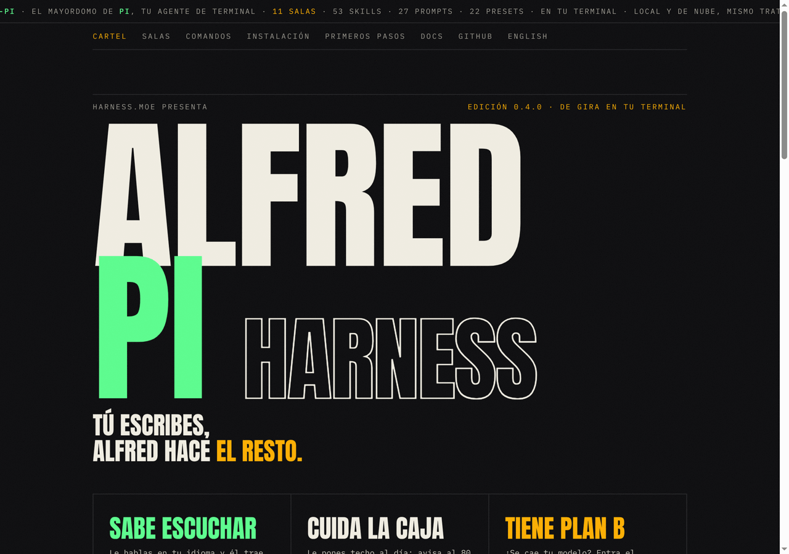
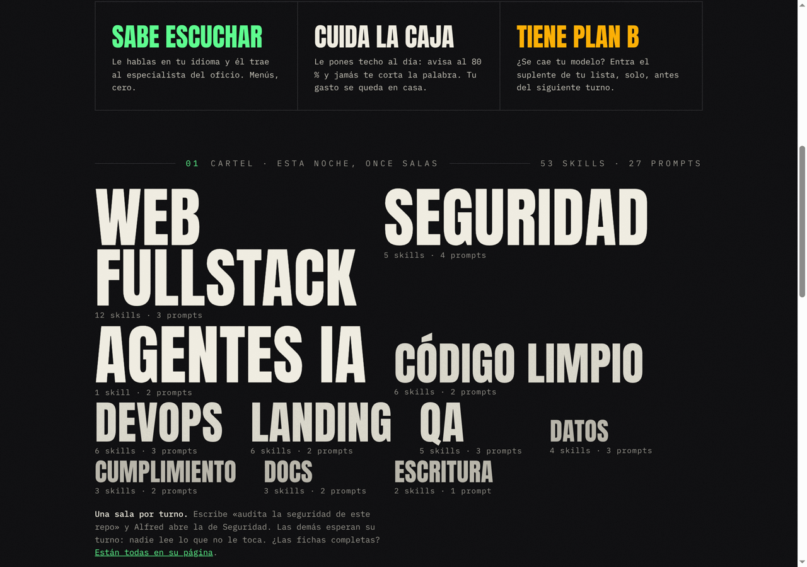
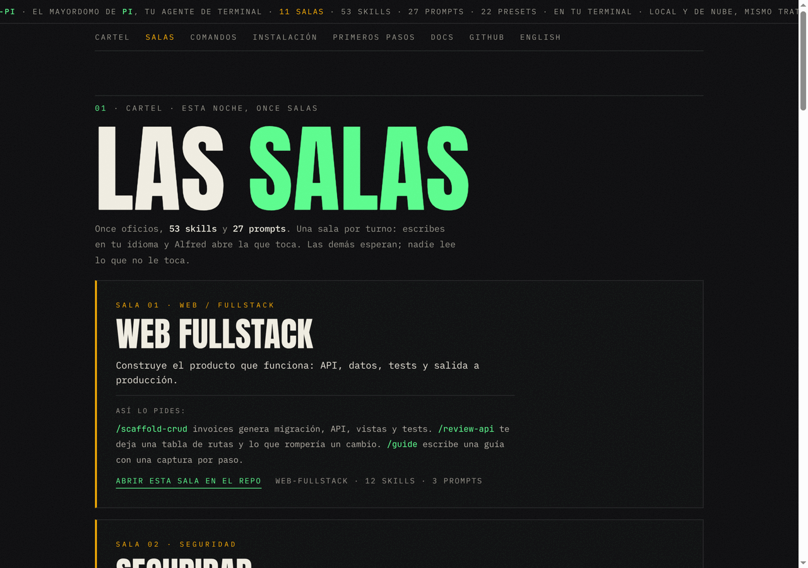
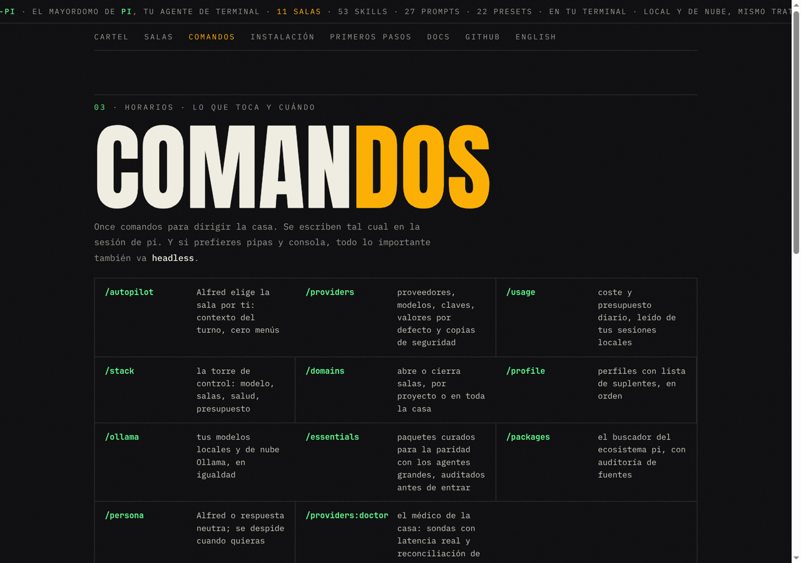
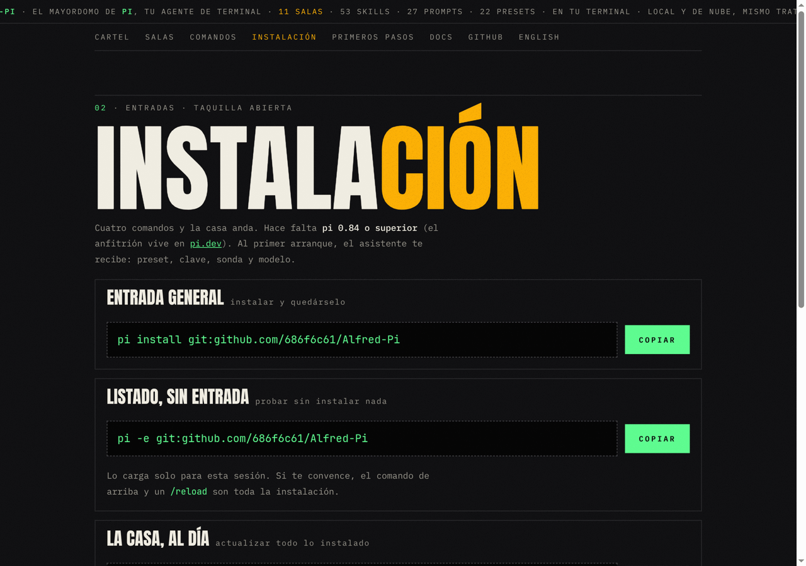
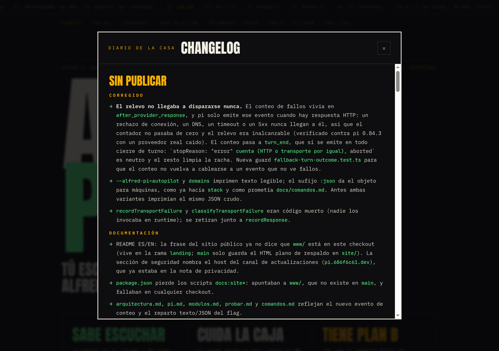

# Alfred-Pi

**[Léelo en español](README.md)**

```
   _____ _____      _    _          _____  _   _ ______  _____ _____       __  __  ____  ______ 
 |  __ \_   _|    | |  | |   /\   |  __ \| \ | |  ____|/ ____/ ____|     |  \/  |/ __ \|  ____|
 | |__) || |______| |__| |  /  \  | |__) |  \| | |__  | (___| (___ ______| \  / | |  | | |__   
 |  ___/ | |______|  __  | / /\ \ |  _  /| . ` |  __|  \___ \\___ \______| |\/| | |  | |  __|  
 | |    _| |_     | |  | |/ ____ \| | \ \| |\  | |____ ____) |___) |     | |  | | |__| | |____ 
 |_|   |_____|    |_|  |_/_/    \_\_|  \_\_| \_|______|_____/_____/      |_|  |_|\____/|______|
```

**The control center for [pi](https://pi.dev): a product harness, not a terminal toy.**
A harness.moe product · built by @686f6c61 · v0.4.1 · MIT · tests with bun · 0 dependencies

## What's inside (free, MIT)

A coding agent without a harness is a genius without a house: raw talent, zero
manners. pi provides the foundation (execution, tools, sessions).
**Alfred-Pi builds everything else**: providers and keys, work packs,
budget and relay. You open a folder, open pi, and the house is already
running.

No parallel config, no ghost state: the harness governs pi's native files,
with a diff before writing and a backup before touching. What you configure
is what the agent uses.

**Full technical docs in [docs/](docs/index.md)** (Spanish): what a harness
is and how pi works ([pi.md](docs/pi.md)), architecture
([arquitectura.md](docs/arquitectura.md)), commands and TUI
([comandos.md](docs/comandos.md)), module map
([modulos.md](docs/modulos.md)), the 11 packs
([dominios.md](docs/dominios.md)), install
([instalacion.md](docs/instalacion.md)), data schemas
([datos-y-config.md](docs/datos-y-config.md)), how to extend
([extender.md](docs/extender.md)) and how to test
([probar.md](docs/probar.md)).
The product's public site is the poster at [pi.686f6c61.dev](https://pi.686f6c61.dev) (source in `portfolio/`, deployed from the `portfolio` branch). The technical documentation is read in [`docs/`](docs/index.md) and on GitHub; `docs/auditoria/` is internal workshop and is not published. The old Astro documentation site (`landing` branch) is out of publication.

## The poster (pi.686f6c61.dev)

The product's public face is a festival poster: [pi.686f6c61.dev](https://pi.686f6c61.dev).
Hand-written HTML and CSS, no framework, no build; the source lives in
[`portfolio/`](portfolio/) on this repo and deploys from the
[`portfolio` branch](https://github.com/686f6c61/Alfred-Pi/tree/portfolio).



The line-up of the eleven rooms with a sheet per room, the ticket with the
install command and the set times with the eleven commands. In the footer, the
house diary: the full changelog in a modal, and a spam-proof contact address.



| Rooms | Commands |
|---|---|
|  |  |
|  |  |

## What the house does

1. **The radar (autopilot).** Type "audit this repo's security" and the
   house picks a pack on its own: security context injected, a badge in the
   footer, auditing skills within the model's reach. 11 packs, 53 skills,
   27 prompts, zero menus.
2. **The budget guardian.** A $/day cap: warning at 80%, frugality mode at
   100%. It reads your local sessions and warns you; it never blocks you or
   sends data anywhere.
3. **The relay.** Two failures of the active provider (HTTP or transport)
   and the model stack jumps to the next healthy link before the next turn.
   Never mid-stream.
4. **Package audit.** `/essentials` inspects sources before install. Audit
   on essentials; the search browser is catching up. It informs, you decide.
5. **Providers and keys.** 22 presets (Grok, Kimi, Codex, Claude, GLM,
   local Ollama, Ollama Cloud, LM Studio, vLLM...). Local is first class,
   not a leftover. Masked keys, `$ENV` references, a doctor with real latency.
6. **Alfred (optional).** Courtesy with a technical bite. Dismiss him with
   `/persona`.

## Why this house (one explanation)

The harness, cut like a building, only to place you: you are in charge, pi
runs, and in between sit packs, budget and providers. The command table does
not use this metaphor.

Technical detail in [docs/arquitectura.md](docs/arquitectura.md); the pi host
in [docs/pi.md](docs/pi.md).

```
              ┌───────────────────────────────────────────────┐
              │              YOU ARE IN CHARGE                │
              └───────────────────────┬───────────────────────┘
                                      │ write / ask
 ╔════════════════════════════════════╪═══════════════════════════════════╗
 ║  PERSONA          Alfred, optional. Courtesy with a technical bite.    ║
 ╠═══════════════════════════════════════════════════════════════════════╣
 ║  PACKS / RADAR    One pack per turn. Every pack's skills on the menu.  ║
 ╠═══════════════════════════════════════════════════════════════════════╣
 ║  BUDGET           Doctor, daily cap, package audit.                    ║
 ╠═══════════════════════════════════════════════════════════════════════╣
 ║  PROVIDERS        Models and keys. Writes with diff, backup and        ║
 ║                   atomic rename. Relay between turns. Local included.  ║
 ╚═════════════════════════════════════╤═════════════════════════════════╝
                                     │
              ┌──────────────────────┴──────────────────────┐
              │     PI, THE FOUNDATION (the base harness)   │
              │  agent loop · tools · sessions · jiti       │
              └─────────────────────────────────────────────┘
```

One turn, in four sentences: you write; the radar picks the pack and the
budget checks the till; the model decides with the skills menu and the pack's
context; the house updates the footer and logs health. If a link fails, it
heals between turns, never in the middle of the dance.

## Install

```sh
# canonical way
pi install git:github.com/686f6c61/Alfred-Pi

# or try it without installing anything
pi -e git:github.com/686f6c61/Alfred-Pi
```

Requires [pi](https://pi.dev) 0.84 or higher. Update: `pi update --all`.
Uninstall: `pi remove git:github.com/686f6c61/Alfred-Pi` (your
configuration stays yours).

## First five minutes

On a fresh machine pi opens the **first-run assistant**: preset, key, probe,
default model, radar and budget. Accept what you need, then ask in your own
words.

The budget guardian reads your local sessions and warns you; it never blocks
you or sends data anywhere.

If you already ran it or skipped it: `/providers` for your model (cloud or
local) and `/autopilot` for the radar. New skills need `/reload`.

Optional day one: `/essentials` (parity with the big agents, audited),
`/usage` for the budget, `/profile` for a stack with relay, `/ollama` for
your models.

## Commands

| Command | What for |
|---|---|
| `/providers` | Providers, models, keys, defaults, backups |
| `/autopilot` | The radar: one pack per turn |
| `/persona` | Alfred or neutral |
| `/domains` | Packs per project or global |
| `/profile` | Profiles with relay |
| `/essentials` | Parity with the big agents (curated, audited packages) |
| `/packages` | Ecosystem browser. Audit on essentials; the search browser is catching up. |
| `/usage` | Cost and daily budget |
| `/ollama` | Local and cloud models |
| `/stack` | House status at a glance |
| `/providers:doctor` | The doctor inspects providers and config |

Headless: `pi --alfred-pi=doctor` and `pi --alfred-pi=usage` (also
`stack`, `autopilot` and `domains`; `:json` variants). Reference:
[docs/comandos.md](docs/comandos.md).

## Work packs

| Pack | Skills | Prompts |
|---|---|---|
| **Security** | threat-modeling, owasp-review, sonarqube-audit, secret-scanning, dependency-audit | `/audit` `/threat-model` `/sonar` `/fix-findings` |
| **AI agents** | agent-orchestration (fan-out, DAG/frontier, budgets, merge protocol) | `/fanout` `/implement` |
| **Docs** | documentation (Diátaxis), adr, api-reference | `/adr` `/docs-audit` |
| **Spanish writing** | rae-normas, traduccion-en-es | `/revision-es` |
| **Clean code** | solid-review, refactoring-patterns, tdd-workflow, pr-review-checklist, tech-debt-inventory, ddd-architecture | `/review-clean` `/refactor` |
| **Web / fullstack** | api-design, http-service, app-persistence, async-jobs, e2e-testing, browser-improve, astro-development, visual-guides, web-performance, frontend-security, i18n-l10n, release-gate | `/review-api` `/scaffold-crud` `/guide` |
| **Compliance** | privacy-review, license-compliance, a11y-audit | `/privacy-check` `/a11y-audit` |
| **Landing design** | landing-copy, visual-critique (vision), conversion-checklist, design-systems, ab-testing, seo-analytics | `/landing-review` `/landing-from-image` |
| **DevOps / infra** | docker-workflow, github-actions, incident-triage, kubernetes-triage, observabilidad, db-ops | `/ci` `/diagnose-502` `/infra-audit` |
| **Data / analysis** | sql-optimization, pandas-analysis, dashboard-design, data-quality | `/query-review` `/explore` `/dashboard` |
| **QA / testing** | test-strategy, fixtures-factories, contract-testing, flaky-hunting, bug-repro-loop | `/test-plan` `/flaky` `/coverage-gaps` |

Enable per project or globally; disabling removes only the links this house
created. House rules: RAE-grade Spanish in the Spanish surface, zero emojis,
no em dash inside sentences.

## Data and configuration

Everything lives in pi's native files (`~/.pi/agent/models.json`, `auth.json`,
`settings.json`) plus our own state in `~/.pi/agent/alfred-pi/`
(profiles, autopilot, budget, health, backups). Full schema in the
[code](lib/) and the [technical docs](docs/).

## Security

Zero runtime dependencies; keys always masked; writes with diff, backup and
atomic rename; advisory pre-install audit on essentials. The budget never
leaves your disk. There is house network (models.dev, npm and the update channel,
`pi.686f6c61.dev`); the detail is in
[datos-y-config.md](docs/datos-y-config.md).
Failure policy in [SECURITY.md](SECURITY.md).

## Development

Module map: [docs/modulos.md](docs/modulos.md). How to extend:
[docs/extender.md](docs/extender.md). How to test:
[docs/probar.md](docs/probar.md).

```sh
bun test                                   # no pi needed; count comes from the tree, not a copied 91
pi --alfred-pi=doctor --no-session -p ok # headless smoke
```

`lib/` is pure Node; `screens.ts` and `onboarding-flow.ts` may import pi;
`index.ts` is the adapter. Short guide in
[CONTRIBUTING.md](CONTRIBUTING.md).

## Roadmap

npm publication for the pi.dev gallery. Automatic cost-based routing is out:
the budget informs and the relay jumps on failure, not on price.

## License

MIT. 686f6c61 is "hola" in hexadecimal: the origin of the house's name.
